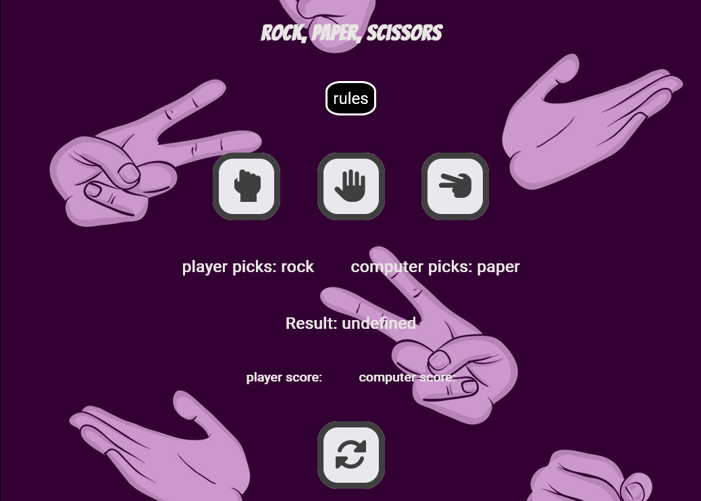
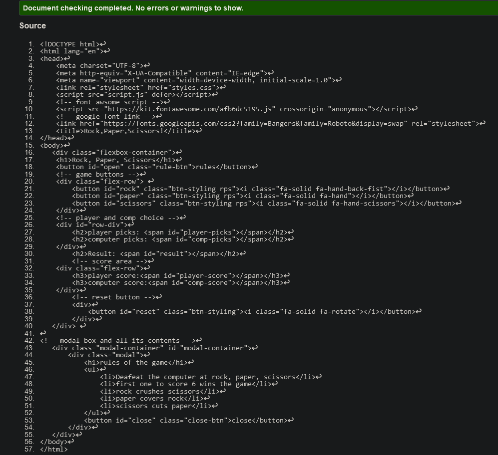

<h1 align='center'> Rock, Paper, Scissors</h1> 

[view my project here.](https://marmiteontoast.github.io/portfolio-project-2/)

This is my rock, paper, scissors game meant to show my current javascript knowledge and how javascript can be used to create an interactive game. This game is interactive and accessible on all common media devices. 

<h2 align='center'></h2>

# user experience (UX)

- ## User Story

    - ## visitors
        - i want visitors to the site to immediately understand the purpose of the website

        - I want the visitor to find the buttons interactive and responsive

        - I want the visitor to grasp the basics and fundermentals of javascript

        - I want the visitor to understand the rules without having to read any instructions 

        - I want the visitor to find the game enjoyable and challenging 

    - ## return visitor

        - I want the return visitor to continue to find the game enjoyable and challenging 

        - I want the return visitor to continue to use this website as a reference for the basics of javascript

- # Design

    - ## colour Scheme

        - The site has three main colours black, white and purple.

    - ## Typography

        - The main font for the site is Roboto with Sans-Serif as fallback and the heading is using the font Bangers, using cursive as its fallback. i used the fallback fonts Sans-serif and cursive because most browsers will be compatiable with it.

    - ## Imagery

        - The website uses a single, large black and white image of hands demonstrating the rock, paper and scirssors signs. The image is used to catch the user's attention and inspire them to play the game and interact with the website.

# Technologies Used

- # Languages used

    - ## HTML

    - ## CSS

    - ## JavaScript

# Features

## Existing Features

- ### game box

    - Featured in the centre of the page, this gets the users attention. 
    - The colour purple was used for contrast against the white text. So the user can clearly see the games features and functions.
    - Transparent box so you are able to see the background image.

<h2></h2>

- ### The rock, paper, scissors heading

    - Presented on the top of the page, heading is in the banger font and all capitals. It's bold, it stands out and is easy for the user to see. From first glance the user is able to identify the name of the game.

<h2></h2>

- ### The rules buttoon
    - Featuring the rule button in between the header and game buttons makes it clear for the user to see.

    - When the user clicks on the button a modal box will pop up with the rules of the game. 

<h2></h2>

- ### Game Buttons

    - The user can clearly see the three choices of rock, paper, and scissors.

    - The use of font awesome icons for my buttons stands out and attracts the user. 

    - Using icons for the buttons gives a clear understanding what the user is pressing. 

    - The mouse curser changes to a pointer so the user understands that this is a button.

    - Buttons also scales when the user hovers over it with the mouse. It's striking and will attract the users attention.

<h2></h2>

- ### player and computer choices

    - This area of the game shows what the user picked and what the computer picked. 

    - Font colour in white for contrast against purple background, so it's  clear for the user to see. 

    - the users choice will display next to the "player picks:" and "computer picks:" statements.

<h2></h2>

- ### The result area

    - In this area the user can clearly see who won the round

    - The outcome will be displayed next to the "Result:" statement 

    - If the user wins "You win" will be displayed and if not "You lose" will be shown.

<h2></h2>

- ###  The Score area

    - This area shows the user the current score. 

    - In this area the user can see how many rounds each of them have won.

    - score will display next to each of the statements featured.

<h2></h2>

- ### reset button

    - This section the user, for what every reason, can restart the game.

    - using an icon for the reset buttton the user can easily see what it is used for. 

<h2></h2>

# Testing 

- ## HTML 

    - HTML page was put through the W3C Markup validator and found to have no errors

    <h2></h2>

- ## CSS

    - The css page was put through the W3C CSS validator and came out with no errors

    <h2></h2>

- ## Javscript

    - The javascript page was put through Js Hint and came out with no errors or warnings

    <h2></h2>

- ## Accessibility

    - I have confirmed that the font styles are readable, and accessibility is a high percentage using lighthouse in devtools.

<h2></h2>

## unfixed Bugs

Because of how the compRandomAnswer function is written i am having some trouble with the result area of my game. it will come up as "undefined" when the page first loads up but after a couple of seconds it starts working properly.

<h2></h2>

# Deployment

- deployment of the site was done on GitHub. The steps of how are as follows:

    - Click on repository "portfolio-project-2" from my account. From there navigate to settings.

    - On the left side of the page under "code and automation" click on pages.

    - Select "main" in the Branch, then you will be provided a link that will take youto the completed website

    [view project here](https://marmiteontoast.github.io/portfolio-project-2/)

# Credits

## content

- Part of my javascipt code was taken from a youtube video found [here.](https://www.youtube.com/watch?v=RwFeg0cEZvQ&t=688s)

- The function used for my scoring system was influenced by a piece of code found on [geeksforgeeks.org.](https://www.geeksforgeeks.org/rock-paper-and-scissor-game-using-javascript/)

## Media

- I got the background image from 123rf.com. A site for people who need images for personal projects. link found [here](https://www.123rf.com/photo_55758399_seamless-pattern-with-hand-gestures-in-comic-cartoon-style-vector-illustration-of-human-hands-playin.html)
