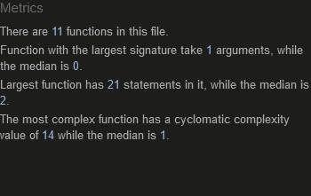

<h1 align='center'> Rock, Paper, Scissors</h1> 

[view my project here.](https://marmiteontoast.github.io/portfolio-project-2/)

This is my rock, paper, scissors game meant to show my current javascript knowledge and how javascript can be used to create a interactive game. This game in interactive and accesiable on all common media devices. 

<h2 align='center'></h2>

# user experience (UX)

- ## User Stories

    - ## visitors
        - i want visitors to the site to immediately understand the purpose of the website

        - i want the visitor to find the buttons interactive and responsive

        - i want the visitor to grasp the basics and fundermentals of javascript

        - i want the visitor to understand the rules without having to read any instructions 

        - i want the visitor to find the game enjoyable and challenging 

    - ## return visitor

        - i want the return visitor to continue to find the game enjoyable and challenging 

        - i want the ruturn visitor to continue to use this website as a reference for the basics of javascript

- # Design

    - ## colour Scheme

        - The site has three main colours black, white and purple.

    - ## Typography

        - The main font for the site is Roboto with Sans-Serif as fallback and the heading is using the font Bangers, using cursive as its fallback. i used the fallback fonts Sans-serif and cursive because most browsers will be compatiable with it.

    - ## Imagery

        - the website uses a single, large black and white image of hands demonstrating the rock, paper and scirssors signs. The image is used to catch the user's attention and inspire them to play the game and interact with the website.

# Technologies Used

- # Languages used

    - ## HTML

    - ## CSS

    - ## JavaScript

# Features

## Existing Features

- ### game box

    - featured in the centre of the page, this gets the users attention 
    - the colour purple was used for contrast against the white text. Used so the user can clearly see the games features and functions.
    - transparent box so you are able to see the background image.

<h2></h2>

- ### The rock, paper, scissors heading
    - presented on the top of the page, heading is in the banger font and all capitals. It's bold, it stands out and is easy for the user to see. From first glance the user is able to identify the name of the game.

<h2></h2> 

- ### Game Buttons

    -  the user can clearly see the three choices of rock, paper, and scissors

    - The use of font awesome icons for my buttons stands out and attracts the user 

    - using icons for the buttons gives a clear understanding what the user is pressing 

    - the mouse curser changes to a pointer so the user understands that this is a button

    - button also scales when the user hovers over it with the mouse. It's striking and will attract the users attention.

<h2></h2>

- ### player and computer choices

    - This area of the game shows what the user picked and what the computer picked 

    - font colour in white for contrast against purple background, so clear for the user to see 

    - the users choice will display next to the "player picks:" and "computer picks" statements

<h2></h2>

- ### The result area

    - In this area the user can clearly see who won the round

    - the oulcome will be displayed next to the "Result:" statement 

    - if the user wins "You win" will be displayed and if not "You lose" will show

<h2></h2>

- ###  The Score area

    - this area show the user the current score 

    - In this area the user can see how many rounds each of them have 

    - score will display next to each of the statements featured

<h2></h2>

- ### reset button

    - This section the user, for what every reason, can restart the game.

    - using an icon for the reset buttton the user can easily see what it is used for. 

<h2></h2>

# Testing 

- ## HTML 
    - html page was put through the W3C Markup validator and found to have no errors

    <h2></h2>

- ## CSS

    - the css page was put through the W3C CSS validator and came out with no errors

    <h2></h2>

- ## Javscript

    - The javascript page was put through Js Hint and came out with no errors or warnings

    <h2></h2>

- ## Accessibility

    - I have confirmed that the font styles are readable, and accessibility is a high percentage using lighthouse in devtools.

<h2></h2>

## unfixed Bugs

The JSHint says there is a "unused variable" on the page, which is the reStart variable, but it is in fact being used within my  reStart function. I reached out to people on slack and they say i  could be happening beacuse i have multiple scripts and the validator can't identify which one it belongs to.

<h2></h2>

# Deployment

- deployment of the site was done on GitHub. The steps of how are as follows:
    - click on repository "portfolio-project-2" from my account. From there navigate to settings.
    - on the left side of the page under "code and automation" click on pages.
    - select "main" in the Branch, then you will be provided a link that will take youto the completed website

    [view project here]('https://marmiteontoast.github.io/portfolio-project-2/')

